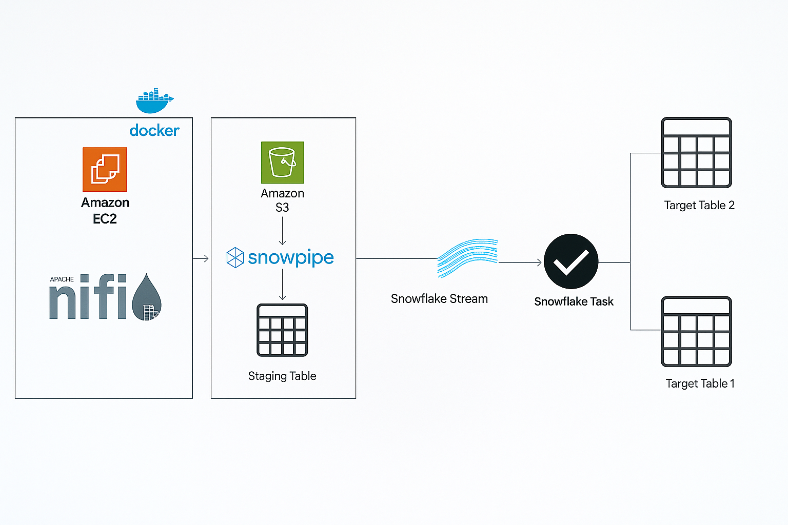
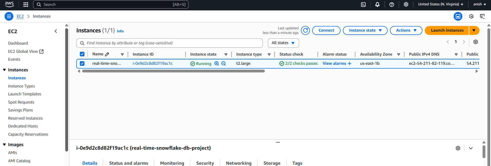
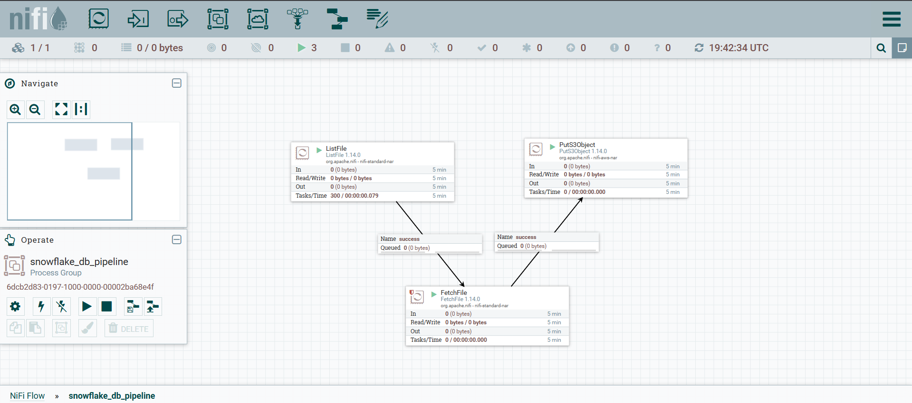
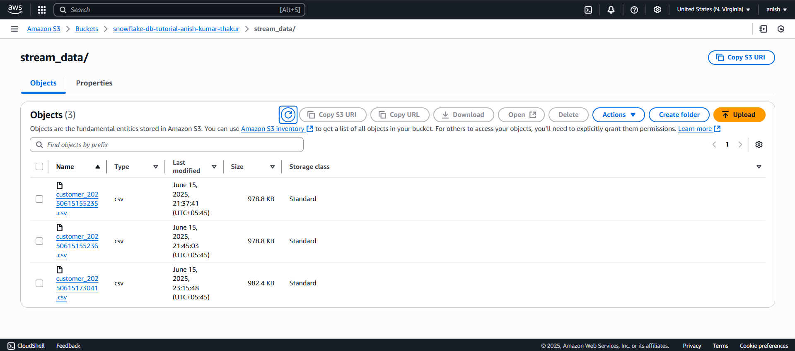

# 📡 Real-Time Data Streaming Pipeline using Apache NiFi, AWS, and Snowflake

This project showcases a complete real-time data streaming architecture that uses:

- Apache NiFi for scalable data ingestion,
- AWS S3 for cloud storage, and
- Snowflake with Snowpipe, Streams, and Tasks for continuous data loading, processing, and Slowly Changing Dimension (SCD) Type 2 handling.

✅ The pipeline ensures near real-time ingestion, historical data tracking, and scalable orchestration across cloud-native tools.

---

## 🏗️ Architecture Diagram



---

## 🧱 Repository Structure

```

.
├── Real-Time Data Streaming using Apache NiFi, AWS, Snowpipe, Stream & Task - Snowflake\_files/
├── SQL/
│   ├── create\_database.sql           # Creates database and schema in Snowflake
│   ├── create\_stages\_and\_pipe.sql   # Creates external stage and Snowpipe
│   ├── streams.sql                   # Creates streams for change tracking
│   ├── merge3.sql                    # SCD Type 2 merge logic
├── comands/
│   └── commands.txt                  # CLI/SQL commands used
├── docker\_exp/
│   └── docker-compose.yml           # Docker setup for Apache NiFi
├── notebooks/
│   └── faker.ipynb                   # Jupyter notebook to generate sample data
├── screenshots/
│   ├── Architecture.png             # Architecture diagram
│   ├── EC2.png
│   ├── nifi\_image.png
│   └── s3bucket.png
├── README.md

````

---

## 🚀 End-to-End Pipeline Overview

- Apache NiFi streams synthetic JSON data into an AWS S3 bucket.
- Snowpipe auto-ingests the files from S3 into Snowflake staging tables.
- Snowflake Streams detect changes in staged data.
- Snowflake Tasks apply SCD Type 2 logic via SQL MERGE, updating the target table with versioned historical data.

---

## ⚙️ Setup Instructions

1. **Clone the Repository**

```bash
git clone https://github.com/AnishThakur22/Streaming-SCD2-Data-Pipeline-Project.git
cd Streaming-SCD2-Data-Pipeline-Project
````

2. **Start Apache NiFi (via Docker)**

```bash
cd docker_exp
docker-compose up -d
```

🔗 Access NiFi UI:

* Locally: [http://localhost:8080/nifi](http://localhost:8080/nifi)
* On AWS EC2: http\://<your-ec2-public-ip>:8080/nifi

3. **Configure Snowflake Environment**
   Execute the SQL files inside the `SQL/` folder **in this specific order**:

* `create_database.sql` — Creates database, schema, and required tables.
* `create_stages_and_pipe.sql` — Creates external stage to AWS S3 and sets up Snowpipe.
* `streams.sql` — Defines CDC streams to track incoming data changes.
* `merge3.sql` — Implements the SCD Type 2 logic using MERGE into history table.

🔒 Make sure you configure correct roles, warehouses, and access policies before execution.

4. **Generate Sample Data (Optional)**

```bash
cd notebooks
jupyter notebook faker.ipynb
```

📦 Generates fake JSON records using the faker library.
🔄 Output can be streamed via NiFi to S3.

5. **Run the Data Pipeline**

* Ingest Data via Apache NiFi → AWS S3 (configure flow in NiFi UI).
* Snowpipe picks up the files and loads into Snowflake.
* Streams and Tasks apply merge logic using the 'merge3.sql'.
* Target Table contains SCD2-compliant historical records.

---

## 🖼️ Screenshots

| Image                                                               | Description                          |
| ------------------------------------------------------------------- | ------------------------------------ |
|                | AWS EC2 instance running NiFi        |
|  | Apache NiFi UI with active data flow |
|      | AWS S3 bucket used as landing zone   |

---

## 📌 Requirements

Before running the project, ensure you have the following installed and configured:

* Docker & Docker Compose
* AWS CLI with configured credentials (`aws configure`)
* Snowflake account with:

  * External stage permissions
  * Role and warehouse access
* Python packages (for `faker.ipynb`):

--bash
pip install faker jupyter


## 👤 Author

Anish Kumar Thakur
GitHub: [@AnishThakur22](https://github.com/AnishThakur22)


💬 Feel free to open issues, report bugs, or submit pull requests for enhancements.

## ✅ Summary

This real-time pipeline project integrates open-source and cloud-native tools to demonstrate how to:

* Ingest data continuously using Apache NiFi
* Store and transfer data via AWS S3
* Automate ingestion into Snowflake with Snowpipe
* Implement SCD Type 2 using Streams and Tasks

Perfect for data engineers looking to implement event-driven, scalable pipelines with versioned history tracking.

### How to see images in the README preview:

- **Make sure your images are pushed in the correct folder (`screenshots/`) with exact file names and case sensitive!**
- **Commit and push everything before checking on GitHub.**
- On GitHub, the README will automatically render with images.
- Locally, open README.md in VS Code and press `Ctrl + Shift + V` to preview with images.

---
